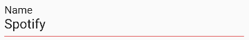

A Flutter Widget for a labeled Text

## Getting started

Add the dependency `labeled_text: ^0.0.1` to your project:

```dart
import 'package:labeled_text/labeled_text.dart';
```

## Usage

```dart
const labeledText(value: "Spotify", description: "Name", lineColor: Colors.red)
```

Displays a Text with your Label like this:



## Publish to pub.dev

To run a test deploy:

```
$ dart pub publish --dry-run
```

To run the final deploy:

```
$ dart pub publish
```
